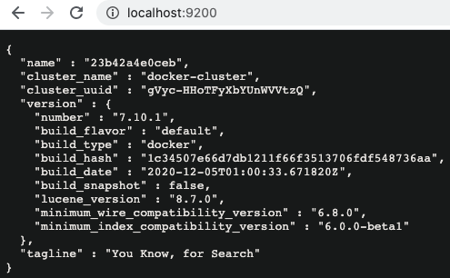
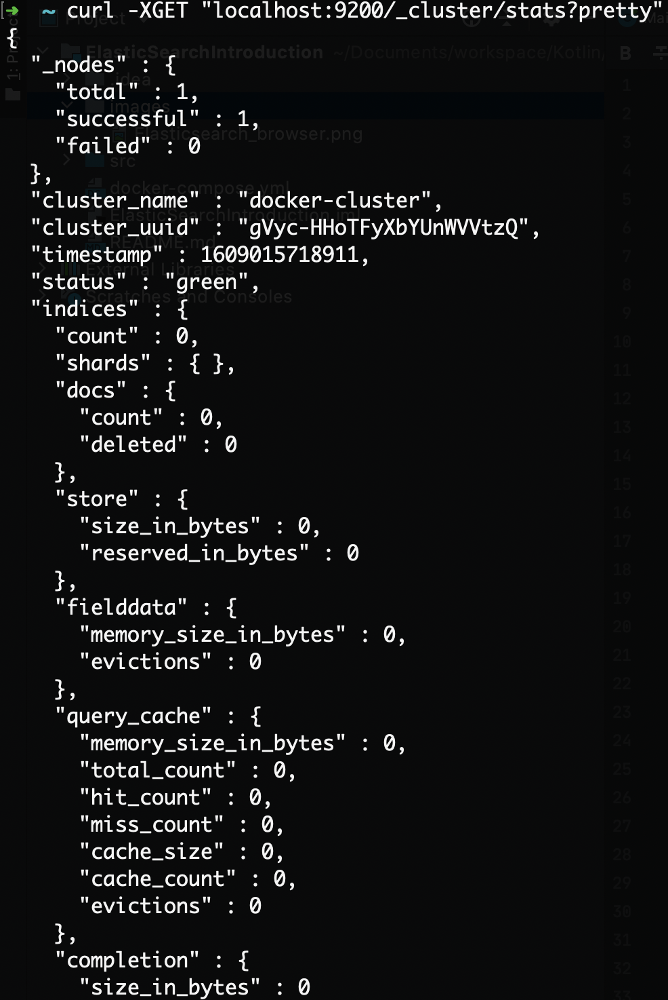

# Elasticsearch Introduction
An introduction to Elasticsearch

## Description
An in-depth paragraph about your project and overview of use.

## Getting Started
### Dependencies
* Docker
* Command line tool
* Curl

### Installing
* [Docker](https://www.docker.com/)
* [Curl](https://curl.haxx.se/download.html)

### Executing program
####Option 1
* Dowload docker
```
docker pull docker.elastic.co/elasticsearch/elasticsearch:7.10.1
```
* Execute it locally
```
docker run -p 9200:9200 -p 9300:9300 -e "discovery.type=single-node" docker.elastic.co/elasticsearch/elasticsearch:7.10.1
```
#####Open command line and validate that elastic search is up and running
* Open browser
```
http://localhost:9200/
```

* Curl
```
Submit cat/nodes request to see that the nodes are up and running:
curl -X GET "localhost:9200/_cat/nodes?v&pretty"
OR
curl -XGET "localhost:9200/_cluster/stats?pretty"
```


####Option 2
* From project path /ElastcSearchIntroduction execute:
```
#Start the service
docker-compose up -d
#-d is to execute in the brackground

#Validate the service
$ docker image ls
$ docker-compose ps

#Stop the service
$ docker-compose stop
```
## Mapping
### Mapping structure
[Mapping](01_mapping.txt)
* Execute the following curl instruction from a console 
```
curl -X PUT "localhost:9200/users?pretty" -H 'Content-Type: application/json' -d'
{
  "settings": {
    "analysis": {
      "analyzer": {
        "full_name_analyzer": {
          "type": "custom",
          "tokenizer": "standard",
          "filter": [
            "lowercase",
            "asciifolding"
          ]
        }
      }
    }
  },
  "mappings": {
    "properties": {
      "company_id": {
        "type":  "keyword"
      },
      "user_id": {
        "type":  "keyword"
      },
      "full_name": {
        "type":  "text",
        "analyzer": "full_name_analyzer",
        "fields": {
          "keyword": {
            "type": "keyword"
          }
        }
      },
      "status": {
        "type":  "keyword"
      },
      "organizations": {
        "type":  "nested",
        "properties": {
          "org_id": {
            "type": "text"
          },
          "org_admin": {
            "type": "boolean"
          },
          "org_name": {
            "type": "text"
          }
        }
      },
      "last_accessed": {
        "type":  "date"
      }
    }
  }
}
'
```
* Expected output
```
{
  "acknowledged" : true,
  "shards_acknowledged" : true,
  "index" : "users"
}
```
* Get the mapping
```
curl -XGET http://localhost:9200/users/_mapping?pretty
```
### Mapping
[Analyzer](https://www.elastic.co/guide/en/elasticsearch/reference/current/analysis-analyzers.html)  
Analyzer is a setting/configuration that we could implement at one or multiple fields in our mapping in order to have a specific behavior.
* Standard Tokenizer - Divides text into terms on word boundaries. It removes most punctuation symbols.
* Filter will help us to evaluate everything in lowercase -> 'NAME', 'name' and 'namE' will be the same. 

[Mapping](https://www.elastic.co/guide/en/elasticsearch/reference/7.10/mapping.html)  
Mapping is the process of defining how a document, and the fields it contains, are stored and indexed. For instance, use mappings to define:  
* Which string fields should be treated as full text fields.
* Which fields contain numbers, dates, or geolocations.
the format of date values.
* Custom rules to control the mapping for dynamically added fields.

[Mapping types](https://www.elastic.co/guide/en/elasticsearch/reference/7.10/mapping-types.html)  
Field types used in our project.
* Keyword - Great for search optimization. Recommendation for single values.
* Text - String type, unstructured text.
* Nested - Consider it as objects, sub-structure that will contain multiple values.
* Date - Date type.

#### Scenario
* User that can be part of a single company, nonetheless, belong to multiple organizations.
* Organizations have a name, id, is admin fields.
## Adding data
* Record 1
```
curl -X PUT "localhost:9200/users/_doc/1?pretty" -H 'Content-Type: application/json' -d'
{
  "company_id": "1001",
  "user_id": "11001",
  "full_name": "Test user1",
  "status": "New",
	"organizations": [
		{
			"org_id": "22001",
			"org_admin": "true",
			"org_name": "org 1"
		}
	],
	"last_accessed": 1603813571757
}
'
```
* Record 2
```
curl -X PUT "localhost:9200/users/_doc/2?pretty" -H 'Content-Type: application/json' -d'
{
  "company_id": "1001",
  "user_id": "11002",
  "full_name": "Test uSEr2",
  "status": "Active",
	"organizations": [
		{
			"org_id": "22001",
			"org_admin": "true",
			"org_name": "org 1"
		}
	],
	"last_accessed": 1603813571757
}
'
```
* Record 3
```
curl -X PUT "localhost:9200/users/_doc/3?pretty" -H 'Content-Type: application/json' -d'
{
  "company_id": "1001",
  "user_id": "11003",
  "full_name": "Test USER1",
  "status": "Enable",
	"organizations": [
		{
			"org_id": "22001",
			"org_admin": "true",
			"org_name": "org 1"
		}
	],
	"last_accessed": 1603813571757
}
'
```
Note: Observe that each URL has a different id  
host:port/index_name/doc_type/id  
localhost:9200/users/_doc/3?pretty"

## Queries
* Get all records
```
curl -X GET "localhost:9200/users/_search?pretty" -H 'Content-Type: application/json' -d'
{
    "query": {
        "match_all": {}
    }
}
'
```
* Get users where full_name has "user1"
```
curl -X GET "localhost:9200/users/_doc/_search?pretty" -H 'Content-Type: application/json' -d'
{
  "query": {
    "term": {
      "full_name": "user1"
    }
  }
}
'
```
* Get users where full_name contains "test":
```
curl -X GET "localhost:9200/users/_doc/_search?pretty" -H 'Content-Type: application/json' -d'
{
  "query": {
    "term": {
      "full_name": "test"
    }
  }
}
'
```
* Filter all users by company id and from there get a specific: 
```
curl -X GET "localhost:9200/users/_doc/_search?pretty" \
-H 'Content-Type: application/json' \
-d '
{
  "query": {
    "bool": {
      "must": {
        "terms"	: {
          "company_id" : [
            "1001"
          ]
        }
      },
      "filter": {
        "term": {
          "user_id": "11002"
        }
      }
    }
  }
}
'
```
* Get users by specific company id and organization id
```
curl -X GET "localhost:9200/users/_search?pretty" \
-H 'Content-Type: application/json' \
-d '
{
  "query": {
    "bool" : {
      "must" : [
        {
          "terms" : {
            "company_id" : [
              "1001"
            ]
          }
        }
      ],
       "filter" : [
	      {
	        "nested" : {
	          "query" : {
	            "bool" : {
	              "must" : [
	                {
	                  "term" : {
	                    "organizations.org_id" : {
	                      "value" : "22001",
	                      "boost" : 1.0
	                    }
	                  }
	                }
	              ]
	            }
	          },
	          "path" : "organizations"
	        }
	      }
	    ]
    }
  }
}
'
```
* TBD
```
```
## Summary
On this document we reviewed:
1. How to install Elasticsearch using docker & docker-compose.
2. Create an Elasticsearch index using a mapping file.
3. Reviewed mapping field types.
4. Adding records manually.
5. Basic and intermediate queries. 

## Help

## Authors
Contributors names and contact info  
Gustavo Leyva  
* [@ovatleyva](https://twitter.com/ovatleyva)
* [@gusleyva](https://github.com/gusleyva)

## Version History
* 0.1
    * Initial Release

## License
This project is licensed under the MIT License.

## Acknowledgments
TBD